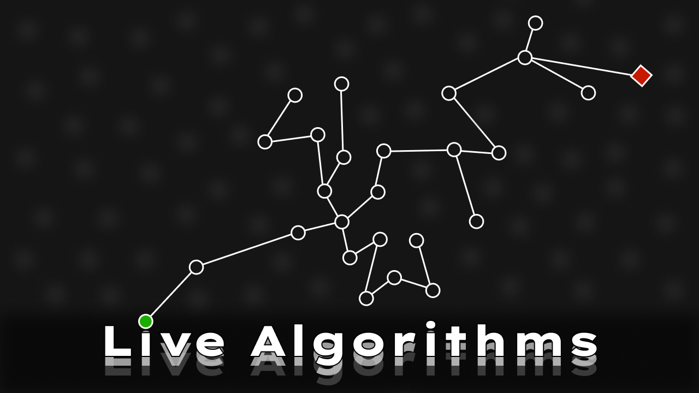

# LiveAlgorithms

 

Live Algorithms is an app that shows the execution of algorithms in graphs. First, you build your own graph with its nodes and edges. After that, you pick an algorithm to observe it running from the beggining to the end, while being able to pause it or stop it.

Four algorithms are offered: Breadth-First Search, Depth-First Search, Djikstra's Shortest Path and Prim's Minimum Spanning Tree.

[Watch here the demo on Youtube](https://youtu.be/NKuEh1R7_Ps)
